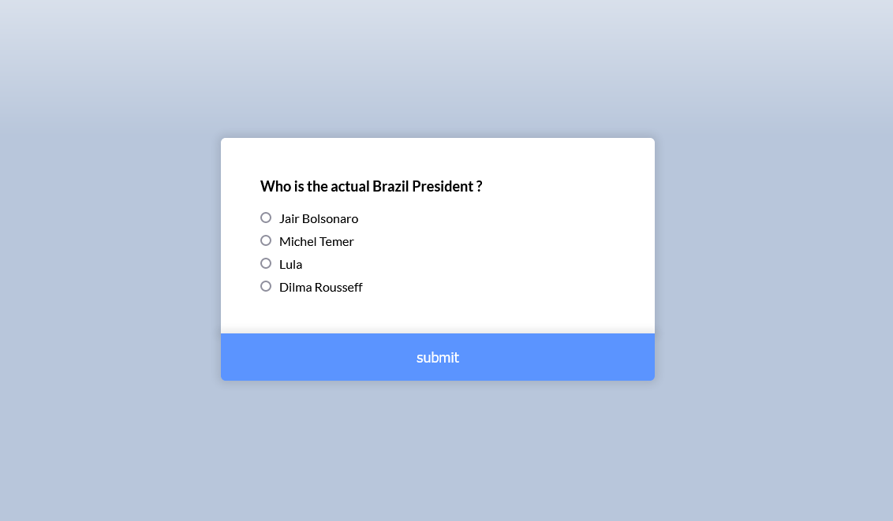

# Quizz App.

This is just a personal study project.

## Table of contents

- [Overview](#overview)
  - [Screenshot](#screenshot)
  - [Built with](#built-with)
  - [Author](#author)

## Overview

### Pages

Git Pages - [Project](https://gabrielfteles.github.io/QuizzApp/)

### The challenge

Users should be able to:

- Answer the quizz.
- Recieve feedback of how many questions was answered correctly.

### Screenshot



## Built with

Technologies

- HTML
- CSS
- JavaScript

Other

- Semantic HTML5 markup
- CSS custom properties
- Flexbox

```css
.proud-of-this-css {
  .wrong-answer .answer:has(input:checked) label::after,
  .correct-answer .answer:has(input:checked) label::after {
    font-size: 1.4rem;
    opacity: 0.6;

   margin-left: 0.6rem;
  }

  .wrong-answer .answer:has(input:not(:checked)),
  .correct-answer .answer:has(input:not(:checked)) {
    pointer-events: none;
    opacity: 0.5;
  }
}
```

## Author

- Linkedin - [Gabriel Teles](https://www.linkedin.com/in/gabriel-teles-b28709234/)
- Twitter - [@ToVivendoErrado](https://www.twitter.com/ToVivendoErrado)
